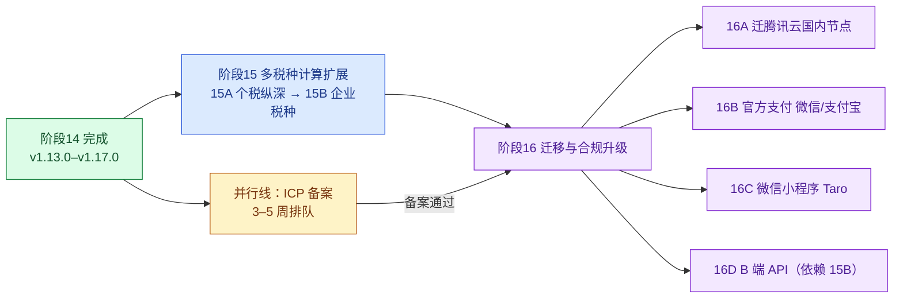

# 阶段15：税务计算能力扩展（多税种）

*创建：2026-09-13 · 状态：🔄 进行中（交付顺序：**先 15A 个税纵深 → 后 15B 企业税种**；**已完成**：15D-1 税种注册表 + 15A-1 劳务报酬/稿酬/特许权预扣预缴落地页，均随 v1.18.0 交付，见 §9 变更记录）*

> 本阶段由「阶段14 收尾 + 竞品调研」推导而来。**编号说明**：新增本阶段为**阶段15**，原「阶段15：迁移与合规升级」顺延为**阶段16**（见 [stage16-migration-and-compliance-plan.md](./stage16-migration-and-compliance-plan.md)）。

---

## 1. 为什么单独立项

本站当前只覆盖**个人所得税**（综合所得 / 经营所得 / 分类所得 / 反向倒算 / 年终奖）。要覆盖用户真实场景并支撑后续商业化，必须扩展到多税种，理由按权重排序：

| # | 理由 | 说明 |
|---|---|---|
| 1 | **原阶段15 被 ICP 备案硬阻塞 3–5 周** | 备案是长周期排队项，期间开发资源空置；本阶段不依赖备案，可立即开工 |
| 2 | **纯前端能力，零依赖** | 遵守项目铁律「计算永远在前端，云端只做增值」——不碰服务器、不碰备案 |
| 3 | **是 B 端 API 的产品基础** | 阶段16 的 B 端 API 要卖给代账公司，**必须有企业税种才有得卖**；顺序上先补算法、再开出口 |
| 4 | **是 SEO 内容弹药** | 每个税种对应一批高商业意图词，可复制已验证的落地页模式（7 条原则 + 逐档对账门禁） |
| 5 | **收编阶段14 未收尾待办** | 「社保基数」「税后工资」两个落地页天然属于多税种扩展范畴，并入本阶段一并交付 |

---

## 2. 与阶段16 的依赖关系（顺序论证）

**关键判断**：阶段16 的 **16A/16B/16C 只依赖备案**，可与阶段15 完全并行推进；**16D（B 端 API）额外依赖 15B**（没有企业税种就没有可售卖的 API）。因此把多税种前置，是让 16D 不在备案通过后再等第二个长周期。

---

## 3. 设计原则（改动时必须遵守）

| # | 原则 | 落地方式 |
|---|---|---|
| 1 | **计算永远在前端** | 所有税种算法放 `src/js/calculation/`，离线可用；云端只做增值（账号/同步/统计） |
| 2 | **口径同源，不复制** | 税率、参数、优惠条件进**税种注册表** `tax-registry.js` 单点定义，页面与云端共用一份 |
| 3 | **页面自己有用** | 每个税种都自带一个能跑的最小速算器，而不是只有「立即使用」按钮 |
| 4 | **计算逻辑可证明等价** | 每个轻量实现 `xxx-quick.js` 配 `tests/xxx-quick.test.js`，与内核在临界点/档位分界上**逐点对拍** |
| 5 | **静态表逐档对账** | 落地页正文里的税率表/示例表由测试与常量文件、内核结果逐一对照（沿用 `bonus-tax` / `salary-tax` / `annual-settlement` 三页已有做法） |
| 6 | **政策时效可追踪** | 注册表每条税率带 `生效期 / 到期日 / 政策依据文号`；到期前必须复核（参考年终奖单独计税执行至 2027-12-31 的处理） |
| 7 | **不做申报，只做测算** | 所有页面统一注明「本测算结果仅供参考，不构成税务建议；实际纳税请以税务部门核算为准」，页脚重复一次 |
| 8 | **SEO 一页一词** | 每个落地页只瞄准一个意图词，canonical 指向自身；复用 [seo-landing-plan.md](./seo-landing-plan.md) 的 7 条原则 |

---

## 4. 竞品对标与取舍

调研对象：**云账房**、柠檬云财税 / 慧算账（代账 SaaS）、官方个人所得税 App。

| 能力 | 云账房 | 柠檬云 / 慧算账 | 官方个税 App | **本站现状** |
|---|---|---|---|---|
| 个税·综合所得 | ✅ | ✅ | ✅ | ✅ |
| 个税·经营所得 | ✅ | ✅ | ⚠️ | ✅ |
| 个税·分类所得 | ✅ | ✅ | ⚠️ | ✅ |
| 个税·反向倒算 | ⚠️ | ⚠️ | ❌ | ✅ **差异化** |
| 个税·年终奖最优分配 | ⚠️ | ⚠️ | ❌ | ✅ **差异化** |
| 社保公积金测算 | ⚠️（页面未提及） | ✅ | ❌ | ✅（`CitySocialConfig` 参数库） |
| 增值税 | ✅ | ✅ | ❌ | ❌ **本阶段补** |
| 企业所得税 | ✅ | ✅ | ❌ | ❌ **本阶段补** |
| 附加税费 / 印花税 | ✅ | ✅ | ❌ | ❌ **本阶段补** |
| 股权激励个税 | ✅ | ⚠️ | ⚠️ | ❌ **15A 补** |
| 个人养老金 / 税优健康险 | ⚠️ | ⚠️ | ✅ | ⚠️（仅作扣除项）→ **15A 独立页** |
| 薪酬 / 工资条 | ✅（工资条小程序） | ✅ | ❌ | ⚠️ |
| 发票 | ✅ | ✅ | ❌ | ❌ **不做** |
| 一键报税申报 | ✅（36 税区） | ✅ | ✅ | ❌ **不做**（需税局接口 + 备案 + 重运营） |
| 智能记账 | ✅ | ✅ | ❌ | ❌ **不做**（超出「计算工具」定位） |
| 客户 / 代账管理 | ✅ | ✅ | ❌ | 🟡（Leads + 运维台，非代账客户管理） |
| **离线可用 / 隐私不出浏览器** | ❌ | ❌ | ✅ | ✅ **差异化** |
| **免登录全功能 / 无广告** | ❌ | ⚠️ | ✅ | ✅ **差异化** |

**取舍结论**：本站是**计算工具**而非代账 SaaS，护城河 = 「免登录 / 离线 / 隐私 / 免费」+「反向倒算 / 年终奖最优分配」。扩展方向是**个税做深 + 补齐小微企业税种测算**，**不追**记账 / 申报 / 发票（那些需要税局接口、备案与重运营，与定位冲突）。

---

## 5. 任务拆分

### 15A 个税纵深（先做 —— C 端流量 + 复用最高）

| 编号 | 子任务 | 交付物 | 验收标准 |
|---|---|---|---|
| 15A-1 ✅ v1.18.0 | 劳务报酬 / 稿酬 / 特许权使用费**预扣预缴**单算器 | 新页 `/seo/labor-withholding.html` + `withholding-quick.js` | 与内核公式逐点对拍；含「并入综合所得 vs 单独」对比 |
| 15A-2 ✅ v1.19.0 | **股权激励个税**（股票期权 / 限制性股票 / 股票增值权 / 股权奖励） | 新页 `/seo/equity-incentive.html` + `equity-incentive-quick.js` | 与内核 `calculateTaxByTaxableIncome` 逐点对拍；同年内合并计税；「并入」只作政策到期后的对照；政策依据文号入注册表 |
| 15A-3 ✅ v1.20.0 | **离职补偿金**免税额度测算（3 倍社平工资 + 12 年上限） | 新页 `/seo/severance.html` + `severance-quick.js` | 与内核 `calculateTaxByTaxableIncome` 逐点对拍；**超额部分「不并入当年综合所得、单独适用年度税率表」**（原验收标准写的「并入」有误，已更正）；免税额度只抵符合法定标准的补偿；页面写明「不再按工作年限平均」 |
| 15A-4 ✅ v1.21.0 | 专项附加扣除「年度确认 + 多抵多少」试算（12 月确认季流量） | 新页 `/seo/special-deduction.html` + `special-deduction-quick.js` | 七项扣除组合试算 + 政策依据链接；**少交的税 = 扣除前应纳税额 − 扣除后应纳税额**（与内核 `calculateTaxByTaxableIncome` 逐点对拍，杜绝「扣除额 × 税率」）；房贷利息与房租互斥、大病医疗起扣线与限额、分摊比例年度内不得变更；页面写明每年 12 月确认 |
| 15A-5 ✅ v1.22.0 | 个人养老金**节税试算**（独立页） | 新页 `/seo/private-pension.html` + `private-pension-quick.js` | 缴费按 12000 元/年限额据实扣除、投资暂不征税、领取按全额 3% 单独计税；净优惠 = 缴费少交 − 领取时 3%，并给出回本线；**能算出「不划算」**（3% 档省 3% 交 3%，净优惠为 0）。税优健康险 / 企业年金试算仍待做 |
| 15A-6 ✅ v1.23.0 | 外籍个人 / 港澳台个税优惠（8 项补贴免税，政策至 2027 年底） | 新页 `/seo/expat-allowance.html` + `expat-allowance-quick.js` | 政策到期提醒机制**已接入注册表**：到期日 2027-12-31 写入注册表、倒计时与「已过期」判定只读 `statusOf`，页面不自己算日期，并写明 2028 年起改为专项附加扣除；津补贴免税与专项附加扣除**二选一**（不得同时享受、年度内不得变更），两条路径的少交税额均与内核对拍 |
| 15A-7 ✅ v1.24.0 | 提前退休 / 内部退养一次性收入 | 新页 `/seo/early-retirement.html` + `early-retirement-quick.js` | **与离职补偿口径已明确区分**：提前退休**真分摊**（按年减 6 万、算完乘回年数、年度表，年度数 = 月份 ÷ 12 可为小数）；内部退养**平均只为定档**（税基是「当月工资 + 一次性收入」全额、月度表、与当月工资合并定档）；「3 倍社平工资免税」**只属于**离职补偿，页面写明不能套用 |
| 15A-8 ✅ v1.25.0 | 年度汇算「多处工资 / 年中跳槽」深度版 | 增强现有 `/seo/annual-settlement.html` + `annual-settlement-quick.js#multiJobSettlementOf` | **两个补税机制分开讲清楚**：年中跳槽补的是**档位重置**的差额（新单位累计预扣从 0 重新开始、速算扣除数扣两次），无缝跳槽（月数合计 12）6 万一份没多扣照样补税；多处任职并行才叠加「重复扣 6 万」。汇算减除费用按**全年定额 60000 元**（不按任职月数折算），专项附加扣除同一项目只能扣一份。多段速算器输出两个差额来源（重复减除的基本减除费用 / 重复申报的专项附加），四种典型场景（补 2520 / 补 7512 / 补 1020 / 退 810）由常量驱动并与内核对拍；门禁 202 → 205 项、单测 38 套件 728 例 → 739 例 |

### 15B 企业税种（后做 —— B 端方向，为阶段16 的 B 端 API 铺路）

| 编号 | 子任务 | 交付物 | 验收标准 |
|---|---|---|---|
| 15B-1 | **增值税**：小规模（1% / 3% 优惠、季度免征额度）与一般纳税人（进销项、多档税率、价税分离） | 新页 + `vat-quick.js` | 两种纳税人身份切换；优惠期参数化 |
| 15B-2 | **企业所得税**：一般 25% / 小微（实际税负 5%，门槛 300 万·300 人·5000 万）/ 高新 15% | 新页 + `corporate-income-tax-quick.js` | 优惠门槛边界值对拍 |
| 15B-3 | **附加税费**：城建税 7/5/1%、教育费附加 3%、地方教育附加 2%（随增值税联动） | 与 15B-1 同页 | 自动联动、地区差异化 |
| 15B-4 | **印花税**：13 个税目计算 | 新页 | 税目表结构化 + 政策依据入注册表 |
| 15B-5 | 个体工商户「核定 vs 查账」对比（衔接现有经营所得页） | 增强页 | 两种征收方式并排对比 |
| 15B-6 | 残保金 / 工会经费（可选，优先级最低） | 新页 | — |

### 15C 社保 / 薪酬（合并阶段14 未收尾落地页）

| 编号 | 子任务 | 交付物 |
|---|---|---|
| 15C-1 | 社保公积金计算器（复用 `CitySocialConfig` 参数库）→ 收尾 `/seo/social-base.html` |
| 15C-2 | 税后工资 / 谈薪倒算 → 收尾 `/seo/net-salary.html` |
| 15C-3 | 企业用工成本测算（含单位缴纳部分）→ 为 15B / 16D 铺垫 |

### 15D 架构与守护（横切，必做）

| 编号 | 子任务 | 说明 |
|---|---|---|
| 15D-1 ✅ v1.18.0 | **税种注册表** `tax-registry.js` | 统一税率常量、生效期、政策依据、优惠条件，避免各页复制（`get` / `basisOf` / `resolveParams` / `statusOf` / `expiringWithin`；数值仍在 `tax-constants.js`，注册表只记参数所在全局量） |
| 15D-2 | 纯计算模块规范 `*-quick.js` + 逐点对拍测试 | 复用 `bonus/salary/annual-settlement-quick` 既有模式 |
| 15D-3 | 税率 / 政策**多税种版本化** | 扩展 `tax-rates-sync.js` + `TaxRateConfig` 支持多税种热更新与回滚 |
| 15D-4 | 前端入口 | 导航新增「更多税种」或独立工具页（避免污染主页计算流） |
| 15D-5 | **SEO 落地页矩阵** | 每税种一页，复用 `seo-landing-plan.md` 的 7 条原则与断言模式 |
| 15D-6 | 门禁与口径同步 | `verify:local` 断言递增、`tools/ops/release-metrics.js` 口径同步、文档口径收口 |

---

## 6. 验收与守护

- **单测**：每个 `xxx-quick.js` 配 `tests/xxx-quick.test.js`，在临界点 ±1 元、档位分界点、极值、非法输入上与内核逐点对拍；落地页正文静态表与常量文件、内核结果逐档对照。
- **门禁**：`npm run verify:local` 前端冒烟段按页面递增断言（可访问性 + `rel="canonical"` + `FAQPage` 结构化数据 + 静态税率表逐档对账 + 示例表可读 + CTA 归因 `?source=seo_<page>`）；`robots.txt` / `sitemap.xml` 收录自洽（新页必须进 sitemap，且 sitemap 内每条 URL 实测 200）。
- **口径**：`npm run verify:release` 校验版本五处落点与文档口径（套件/用例数、门禁项数、线上指纹数）与实测一致，非当前口径的历史声明必须带版本前缀。
- **免责声明**：每个新页面统一「本测算结果仅供参考，不构成税务建议」，页脚重复一次。

---

## 7. 时间线与依赖

| 批次 | 依赖 | 预估 |
|---|---|---|
| 15D-1/15D-2（注册表 + 规范） | 无 | 与 15A 同步起底 |
| 15A（个税纵深，8 项） | 15D-1/15D-2 | 2 周 |
| 15C（社保/薪酬 3 项） | `CitySocialConfig`（已有） | 与 15A 并行，3–5 天 |
| 15B（企业税种，6 项） | 15D-1/15D-2 | 1.5 周 |
| 15D-4/15D-5/15D-6（入口 + 落地页矩阵 + 门禁） | 各税种就绪后逐项 | 随批次滚动 |

**总预估 3 周+**，与 ICP 备案（3–5 周排队）并行推进，互为缓冲。

---

## 8. 风险与合规

| 风险 | 应对 |
|---|---|
| 税种越多，**口径维护成本**越高 | 15D-1 税种注册表单点定义 + 逐档对账门禁 + 多税种版本化热更新 |
| **政策时效**（小微优惠、年终奖、外籍补贴都有到期日） | 注册表带 `生效期 / 到期日` 字段 + 到期提醒（参考年终奖页 2027-12-31 做法） |
| B 端税种**计算 ≠ 申报**，用户可能误以为能报税 | 所有页面统一免责声明；明确「只算不报」 |
| 税种扩展**摊薄个税纵深** | 15A / 15B 分批交付，先 15A（C 端流量）后 15B（B 端付费） |
| 备案若提前通过 | 16A/16B/16C 可随时插入，15A/15C（纯前端）不受影响 |

---

## 9. 变更记录

| 日期 | 变更 | 决策 |
|---|---|---|
| 2026-09-13 | 新增阶段15「税务计算能力扩展」；原阶段15「迁移与合规升级」顺延为阶段16；确定 15A 个税纵深优先于 15B 企业税种 | 确认 |
| 2026-09-14 | **15A-2 股权激励个税落地页随 v1.19.0 交付**：新页 `/seo/equity-incentive.html` + `equity-incentive-quick.js`；常量新增 `equityIncentiveRules`、注册表新增 `equity-incentive` 条目；门禁 172 → 177 项、单测 30 套件 595 例 → 31 套件 613 例 | 单独计税是「不并入」而非「可选并入」，页面上的「并入综合所得」只作**政策到期后（2028 年起）的对照**，不是让用户二选一；税率仍复用 `comprehensiveTaxRates`（不新增第二张表），对拍对象为内核 `calculateTaxByTaxableIncome` |
| 2026-09-15 | **15A-8 汇算页「多处任职 / 年中跳槽」深度版随 v1.25.0 交付**：增强现有 `/seo/annual-settlement.html`（新增多段速算器 + 四种典型场景示例表 + 三条口径纠偏 + 三条 FAQ，JSON-LD 同步到 8 问）；`annual-settlement-quick.js` 新增 `multiJobSettlementOf` 与 `ANNUAL_BASIC_DEDUCTION = 60000`；门禁 202 → 205 项、单测 38 套件 728 例 → 739 例 | 「跳槽补税」与「重复扣 6 万」**不是一回事**：各段独立累计预扣（新单位从 0 开始）→ 同一年收入被拆两段各适用一次低档、速算扣除数扣两次，无缝跳槽（月数合计 12）6 万一份没多扣**照样补 2520**；只有多处任职**并行**才叠加重复扣 6 万（示例补 7512 = 重复 6 万 + 档位重置）。汇算减除费用是**全年定额 60000 元**、不按任职月数折算，所以年中入职往往退税（示例退 810）；专项附加扣除**同一项目只能扣一份**，两处都申报的要补回来 |
| 2026-09-15 | **15A-7 提前退休 / 内部退养落地页随 v1.24.0 交付**：新页 `/seo/early-retirement.html` + `early-retirement-quick.js`；常量新增 `earlyRetirementRules`、注册表新增 `early-retirement` 条目；门禁 197 → 202 项、单测 37 套件 710 例 → 38 套件 728 例 | 三套「一次性收入」口径必须分开：提前退休**真分摊**（应纳税额 = {〔(补贴 ÷ 实际年度数) − 60000〕× 税率 − 速算扣除数} × 年度数，年度数 = 实际月份 ÷ 12、可为小数，年度表）；内部退养**平均只为定档**（月均额 + 当月工资 − 5000 定档，税基 = 当月工资 + 一次性收入 − 5000 **全额**，月度表，与年终奖取档同源）；**「3 倍社平工资免税」只属于解除劳动关系的一次性补偿**（15A-3 离职补偿页），不能套到提前退休与内部退养 —— 这两者没有免税额度，只有常规费用扣除标准。示例：同为 12 万一次性收入，所属月份 60 → 3630 元，24 → 11890 元 |
| 2026-09-15 | **15A-6 外籍个人津补贴免税落地页随 v1.23.0 交付**：新页 `/seo/expat-allowance.html` + `expat-allowance-quick.js`；常量新增 `expatAllowanceRules`、注册表新增 `expat-allowance` 条目（**有到期日 2027-12-31**）；门禁 192 → 197 项、单测 36 套件 693 例 → 37 套件 710 例 | 津补贴免税与专项附加扣除**二选一**：不得同时享受，且一经选择在一个纳税年度内不得变更 —— 页面两条都算只是为了比较，实际申报只能选一条；两条路降的都是**应纳税所得额**，少交的税 ≡ 内核两段计税之差（跨档时「金额 × 税率」必然高估）；**政策到期提醒接入注册表**：到期日写进注册表、倒计时与「已过期」由 `statusOf` 统一给出，页面不自己算日期，正文写明 2028 年起若未延续应改为享受专项附加扣除（前一版过渡口径就曾于 2021-12-31 结束、再由 2023 年第 29 号公告延续） |
| 2026-09-15 | **15A-5 个人养老金落地页随 v1.22.0 交付**：新页 `/seo/private-pension.html` + `private-pension-quick.js`；常量新增 `privatePensionRules`、注册表新增 `private-pension` 条目；门禁 187 → 192 项、单测 35 套件 674 例 → 36 套件 693 例 | 缴费扣的是**应纳税所得额**（少交的税 ≡ 内核两段计税之差）；领取按**领取额全额 × 3%**（本金与收益一起计、不并入综合所得）；**不是所有人都划算** —— 适用税率 3% 的人省 3%、领取时再交 3%，净优惠为 0，页面必须能算出来并提示，回本线 = 累计少交的税 ÷ 3%；超过 12000 元/年的部分当年不可扣、不能结转 |
| 2026-09-15 | **15A-4 专项附加扣除落地页随 v1.21.0 交付**：新页 `/seo/special-deduction.html` + `special-deduction-quick.js`；常量新增 `specialDeductionRules`、注册表新增 `special-deduction` 条目；门禁 182 → 187 项、单测 34 套件 651 例 → 35 套件 674 例 | 专项附加扣除扣的是**应纳税所得额**而不是直接减税额：少交的税 = 扣除前应纳税额 − 扣除后应纳税额，与内核 `calculateTaxByTaxableIncome` 逐点对拍；「扣除额 × 税率」在跨档时必然高估（示例 6 万扣除、扣除前 20 万：正确 11600、天真算法 12000），页面用这个差异做纠偏；住房贷款利息与住房租金同一年度二选一（互斥）；大病医疗是唯一「据实 + 限额、且只能汇算时扣」的一项；每年 12 月确认未做只是暂停按月扣除，汇算可补扣，不会少扣税 |
| 2026-09-14 | **15A-3 离职补偿金落地页随 v1.20.0 交付**：新页 `/seo/severance.html` + `severance-quick.js`；常量新增 `severanceRules`、注册表新增 `severance` 条目；门禁 177 → 182 项、单测 33 套件 632 例 → 34 套件 651 例 | 超额部分「不并入当年综合所得、单独适用综合所得**年度**税率表」，且**不再按工作年限平均** —— 国税发〔1999〕178 号的「÷ 工作年限（≤12）」做法自 2019 年起不再执行（原 15A-3 验收标准写成「并入」是错的，已更正）；「12 年 / 3 倍月工资」是《劳动合同法》对经济补偿金本身的封顶，与免税额度（上年职工**年平均**工资 × 3）不是一回事；免税额度只抵符合法定标准的补偿，超出法定标准发放的部分照章计税 |
| 2026-09-14 | **15D-1 税种注册表 `tax-registry.js` + 15A-1 劳务报酬/稿酬/特许权预扣预缴落地页随 v1.18.0 交付**；常量新增 `withholdingTaxRates` / `otherIncomeRules`，内核 `calculateOtherIncome` 与 `withholding-quick.js` 读同一份（对拍证明等价）；门禁 167 → 172 项、单测 28 套件 570 例 → 30 套件 595 例 | 注册表只存元数据（生效期/到期日/政策文号 + 参数在哪个全局量里），数值仍在 `tax-constants.js`；新常量暂不纳入 `tax-rates-sync.js` 后端热改字段，待 15D-3 多税种版本化统一扩 |
